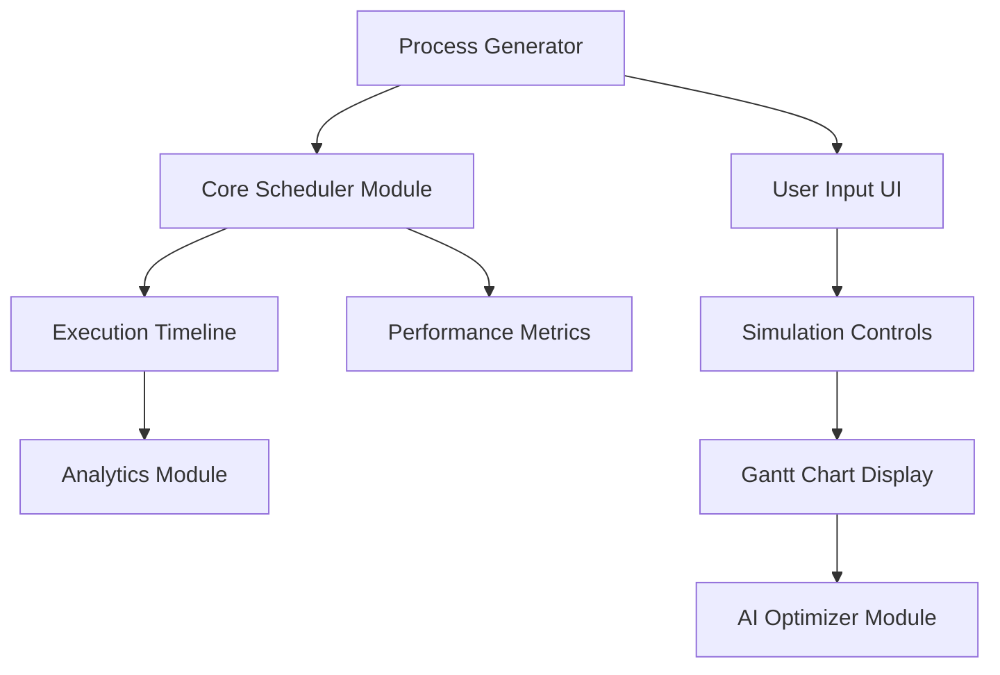

# ProcessOptimizeAI Dashboard

Welcome to the ProcessOptimizeAI Dashboard project. This tool simulates and visualizes various CPU scheduling algorithms in an interactive, web-based environment. It includes features such as scheduling algorithm selection, Gantt charts, simulation controls, CPU utilization graphs, and AI-generated performance suggestions.

## Table of Contents

1. [Overview](#overview)
2. [Project Structure](#project-structure)
3. [Workflow Chart](#workflow-chart)
4. [Key Features](#key-features)
5. [Prerequisites](#prerequisites)
6. [Installation & Setup](#installation--setup)
7. [Usage](#usage)
8. [Scheduling Algorithms](#scheduling-algorithms)
9. [API Simulation](#api-simulation)
10. [UI Components](#ui-components)
11. [Dashboard Components](#dashboard-components)
12. [Author & License](#author--license)

---

## Overview

This project demonstrates CPU process scheduling methods, allowing users to:

- View processes, their attributes (burst time, arrival time, priority, etc.), and scheduling details.
- Simulate execution using seven different scheduling algorithms including FCFS, SJF, SRT, Priority, Round Robin, HRRN, and MLQ.
- Toggle preemptive mode for applicable algorithms.
- Observe metrics such as average waiting time, turnaround time, throughput, CPU utilization, and context switches.
- Leverage AI suggestions for potential optimizations.
- Compare performance across all algorithms with the same process set.

The dashboard is built with HTML, Tailwind CSS, Chart.js, and plain JavaScript. There's no server-side component—data is simulated via an in-browser API.

## Project Structure

```
os-project
├── index.html
├── js
│   ├── api.js
│   ├── dashboard.js
│   ├── main.js
│   ├── schedulers.js
│   ├── ui.js
│   └── ...
└── README.md
```

- **index.html**  
  The main entry point for the application's user interface.
- **js/api.js**  
  Simulates an API call to fetch random processes and provides AI optimization suggestions.
- **js/dashboard.js**  
  Manages simulation states, charts for CPU utilization, and the interactive dashboard.
- **js/schedulers.js**  
  Contains implementations of various CPU scheduling algorithms.
- **js/ui.js**  
  Handles UI rendering for charts, process lists, Gantt charts, and algorithm visualizations.
- **js/main.js**  
  Initializes the application workflow, ties together the UI renders, scheduling algorithm calls, and AI suggestions.

## Workflow Chart



## Key Features

- **Multiple Scheduling Algorithms**: FCFS, SJF, SRT, Priority Scheduling, Round Robin, HRRN, and MLQ.
- **Interactive Visualization**: Gantt chart, step-by-step algorithm execution, and real-time CPU utilization graphs.
- **Preemptive Mode**: Toggle between preemptive and non-preemptive scheduling for applicable algorithms.
- **Algorithm Comparison**: Compare performance metrics across all algorithms using the same process set.
- **AI Suggestions**: Highlights bottlenecks and provides recommendations based on current metrics.
- **Step-by-Step or Automated Simulation**: Start, pause, reset, or step through each time unit.
- **Dynamic Charts**: View CPU utilization rates in real-time as the simulation progresses.
- **Detailed Metrics**: Track waiting time, turnaround time, throughput, context switches, and CPU utilization.

## Prerequisites

- A modern web browser (Chrome, Firefox, Edge, Safari) with JavaScript enabled.
- Basic knowledge of CPU scheduling and JavaScript is helpful but not required.

## Installation & Setup

1. Clone or download this repository onto your local machine.
2. Navigate to the `os-project` folder.
3. No additional build steps are needed. You can run the project by opening `index.html` in a web browser.

## Usage

1. Open `index.html` in your browser.
2. Select a scheduling algorithm from the **Scheduling Configuration** panel.
3. Configure algorithm-specific settings if applicable (time quantum for Round Robin, queue count for MLQ, etc.).
4. Set the number of processes to generate and click **Generate Processes**.
5. Use the simulation controls to start, pause, reset, or step through the simulation.
6. Observe the process queue, Gantt chart, CPU utilization graph, and metrics as the simulation runs.
7. View AI-generated suggestions for optimizing the current algorithm.
8. Click **Compare Current Process Set** to see how different algorithms would perform with the same processes.
9. Adjust the **Simulation Speed** slider to control the pace of the automated simulation.

## Scheduling Algorithms

1. **FCFS (First Come First Served):**  
   Processes are executed in the order they arrive. Simple but can lead to the convoy effect where short processes wait behind long ones.

2. **SJF (Shortest Job First):**  
   Non-preemptive algorithm that selects the process with the shortest burst time. Minimizes average waiting time but may cause starvation of longer processes.

3. **SRT (Shortest Remaining Time):**  
   Preemptive version of SJF. If a new process arrives with a shorter remaining time than the current process, it immediately gets the CPU.

4. **Priority Scheduling:**  
   Processes are selected based on priority value (lower number = higher priority). Can be run in preemptive or non-preemptive mode.

5. **Round Robin:**  
   Each process gets a small time slice (quantum) in a circular order. Good for time-sharing systems and better response time.

6. **MLQ (Multi-Level Queue):**  
   Processes are assigned to different queues based on priority. Higher priority queues are serviced first, using FCFS within each queue.

## API Simulation

- **js/api.js**: Generates random processes with attributes like `burstTime`, `arrivalTime`, `priority`, and `status`.
- Provides AI-based optimization suggestions by analyzing simulation metrics.
- Assigns random colors to processes for better visualization in the Gantt chart.

## UI Components

- **Process Table**: Displays each process with key attributes and color-coded statuses.
- **Gantt Chart**: Dynamic visualization showing process execution order and duration.
- **CPU Utilization Graph**: Real-time chart showing CPU utilization percentage over time.
- **Algorithm Visualization**: Step-by-step visualization of the current algorithm's execution logic.
- **Algorithm Comparison**: Table comparing performance metrics across all algorithms.
- **Performance Metrics Panel**: Real-time display of current simulation metrics.

## Dashboard Components

- **Scheduling Configuration**: Select algorithms and set algorithm-specific parameters.
- **Simulation Controls**: Start, Pause, Reset, and Step buttons for controlling the simulation.
- **Speed Control**: Slider to adjust simulation speed.
- **AI Suggestions Panel**: Displays detected bottlenecks and recommended improvements based on current metrics.
- **Process Generation**: Generate random processes with configurable count.

## Author & License

This project is developed for demo and learning purposes. You are free to modify and reuse the code. No official license is attached unless stated otherwise.

For questions or contributions, feel free to open an issue or submit a pull request. We hope this helps you explore CPU scheduling algorithms in a more interactive and engaging way.
